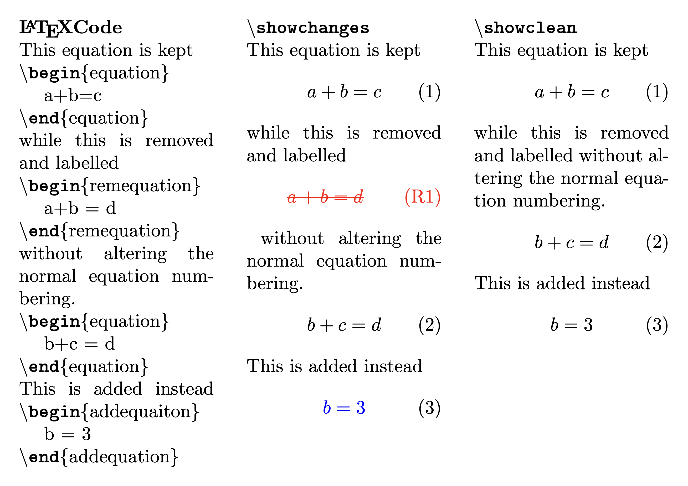
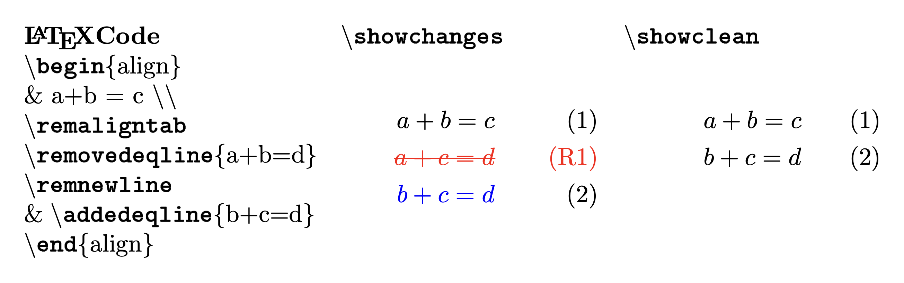
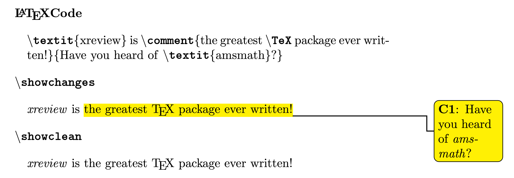
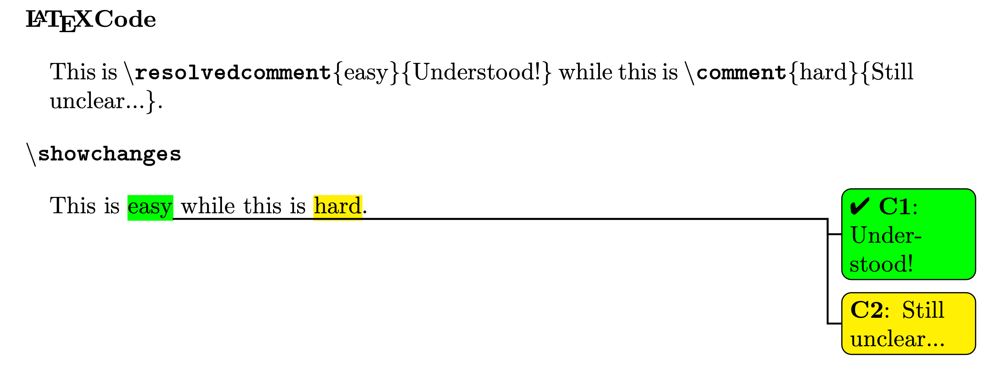
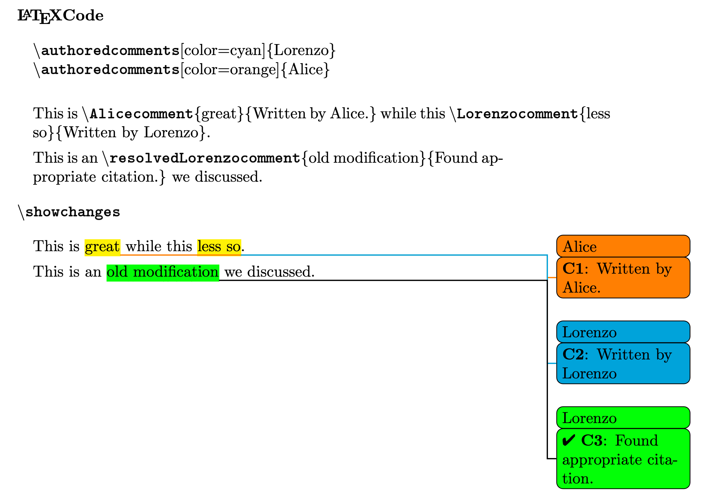

# xreview: reviewing LaTeX document made easy(er)

Have you ever had to make modifications to a manuscript while needing to keep track of the changes? Have you ever been asked by a journal to provide a revised version highlighting the changes *and* a clean version? Is your brain utterly incapable of reasoning about a sentence while it's wrapped in dashes and distracting colors?
Now you can `\usepackage{xreview}` to make your life *a little* less miserable.

> To know how you can start using *xreview*, check the Installation section at the end of this document!

## The basics

*xreview* allows you to quickly show and hide changes to a document.
This is achieved providing two commands:

* `\showchanges` to annotate the changes;
* `\showclean` to compile a clean document.

Changes can be annotated mostly using the commands:

* `\removed` for removed sections
  
  

* `\added` for added sections
  
    

* `\changed` for sections that have been modified
  
    

> You can toggle `\showchanges` and `\showclean`  at any point to only show/hide changes in a certain section!

## Maths and equations

Dealing with changing the aspect of maths in latex is always a little painful. *xreview* tries to deal with most things for you!

Inline math (defined within `$` symbols) can be safely used within `\removed`, `\added`, and `\changed`.

To remove equations, *xreview* provides the `remequation` and `remequation*` environments. These typeset equations as if they were `\removed` and **hide them from the clean version**.

* `remequation*` does not number the equation
* `remequation` introduces **a separate numbering scheme** for removed equations that one still wishes to reference

This is to that **equation numbering will not change between the annotated and clean versions**.
The prefix for removed equation numbering is normally a capital `R`. However, this can be customized to one's preference (see Customization). These labels are fully compatible with referencing commands such as `\label`, `\ref`, and `\eqref`.

Similarly, *xreview* provides the `addequation` and `addequation*` for added equations, which *are indistinguishible from `equation` and `equation*` in the clean version*.



*xreview* also offers tools to deal with removing and adding lines within sets of equations (i.e. the `align` environment). This can be done via the `\removedeqline` and `\addedeqline` commands, which behave like `remequation` and `addequation`.



To ensure proper formatting of both the clean and annotated version, please make sure to change **on `\removedeqline` lines** alignment tabs (`&`) to `\remaligntab` and newline (`\\`) to `remnewline`.

> The use of `\removedeqline` and `\addedeqline` with alignment tabs **within the line** (i.e. `a+b&=c`) is somewhat delicate. Please refer to the full documentation in `xreview.pdf`

## Comments

Comments are a great way to communicate with various authors, to carry out a discussion directly on a shared document or to share ideas and questions together with the compiled manuscript.

*xreview* allows for the possibility to insert comments that out of the box work in one- or two-column documents.

Simple comments can be created with the `\comment` command. They highlight a snippet of text and are **hidden on the clean version**.



**Every comment is numbered** for ease of reference, with a customizable prefix (a capital `C` by default).

Sometimes comments tend to stick around for *a while*. However, this has the downside of hiding which have been resolved and which are still outstanding. 
To avoid this anti-pattern, *xreview* offers the command `\resolvedcomment` to mark a comment as resolved!

Changing `\comment` to `\resolvedcomment` will make outstanding matters stand out atop a sea of calming satisfying green.



> `\comment` and `\resolvedcomment` take the same options and have the same syntax, so you can always resolved your comment no matter how it has been customized!

It is most times helpful to know who wrote a comment. This is made easy by the `\authoredcomments` command.

```tex
\authoredcomments[Optional: mods to comment][Optional: mods to resolvedcomment]{Authorname}
```

This creates two new commands `\Authorenamecomment` and `\resolvedAuthornamecomment` which will mark the author and can easily be distinguished.



> For best result, consider customizing the comments for each author!

## Customization

Most aesthetical aspects of *xreview* are customizable. To do so, simply insert a similar line **in the document preamble**

``` tex
    \renewcommand{\thecommand}{new option}
```

> For example:
> 
> ```tex
> \renewcommand{\addedcolor}{green}
> ```
>
> will make the added text and equations green!

The commands available to be redefined are:

* `\addedcolor` [default: `blue`]: the color of `\added` sections;
* `\removedcolor` [default: `red`]: the color of `\removed` sections;
* `\commentcolor` [default: `yellow`]: the background color of `\comment`;
* `\resolvedcommentcolor` [default: `green`]: the background color of `\resolvedcomment`;
* `\removedeqprefix` [default: `R`]: the prefix for the tag of removed equations;
* `\commentprefix` [default: `C`]: the prefix comment captions.
  
To change the width of the comment box, one can insert in the preamble **after `\usepackage{xreview}`**

``` tex
    \setlength{\marginparwidth}{new width}
```

The default value is `2 cm`, which gives best results on two-column documents

## Installation

Installing a latex package is probably a little more cumbersome than it should. Here are the quickest ways to get started with *xreview*!

> To install *xreview* you are going to need the latest version of `xreview.sty`. You can download the latest stable version from [here](https://github.com/LorenzoPeri17/xreview-latex/releases).

### Installing for a single document

If you plan on using *xreview* on a single document or in a simple directory, by far the simplest way is to download `xreview.sty` and copying it into the same directory of your `.tex` files.

### Installing on Overleaf project

If you want to use *xreview* on Overleaf, simply download `xreview.sty` and copying upload it in the same place as your `.tex` files.

> `xreview.sty` must be in the same directory as the `.tex` file where `\usepackage{xreview}` is used.

### Installing from CTAN for TeX Live

*xreview* is available on the CTAN package repository. If you are using TeX Live as your LaTeX environment, you can install *xreview* globally with 

``` bash
$ tlmgr install xreview
```

> Please see the [installation guide](https://en.wikibooks.org/wiki/LaTeX/Installation) in case of any errors

### Manual Global Instal

If you want to use *xreview* in multiple documents without needing to keep copy-pasting `xreview.sty`, you can install it globally for your TeX environment.

This usually is just a matter of copying `xreview.sty` in the right places (usually `~/texmf/` or `/usr/share/texmf/` on Linux or `~/Library/texmf/` on Mac using MacTeX). Please refer to a more detailed guide (i.e. [here](https://en.wikibooks.org/wiki/LaTeX/Installing_Extra_Packages)) if you are having any trouble.

You can check if the global installation has worked in the terminal with

``` bash
$ kpsewhich xreview
```

or (if you are using TeX Live)

``` bash
$ tlmgr info xreview
```
